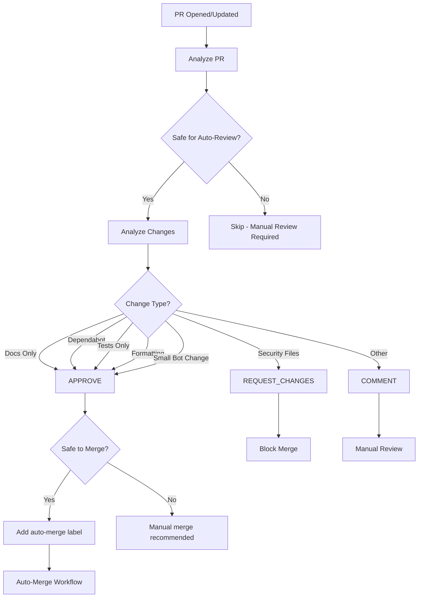
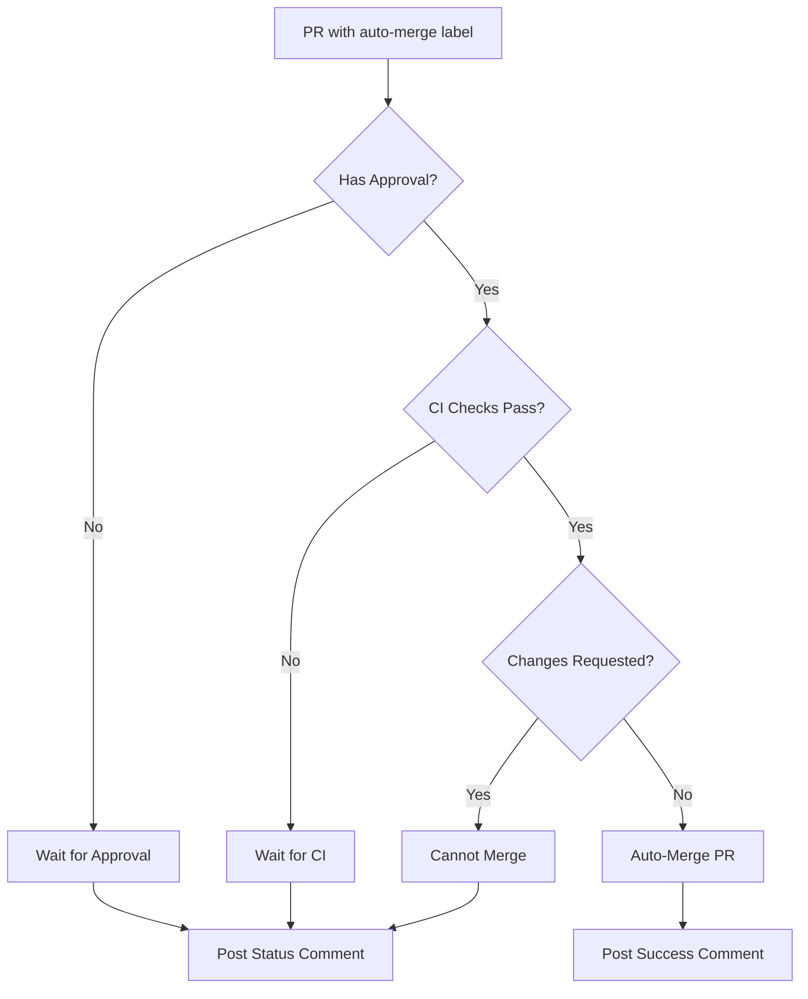

# PR Auto-Review & Auto-Merge System

## Overview

The GOFAP repository features a comprehensive automated PR review and merge system that reduces manual overhead while maintaining code quality and security standards.

## Components

### 1. PR Auto-Review Workflow (`.github/workflows/pr-auto-review.yml`)

Automatically reviews pull requests based on intelligent analysis of changes, providing instant feedback and approvals for safe changes.

### 2. Enhanced Auto-Merge Workflow (`.github/workflows/autonomous-board.yml`)

Automatically merges approved PRs once all CI checks pass and required approvals are in place.

## How It Works

### Auto-Review Process



### Auto-Merge Process



## Approval Criteria

### Automatically Approved (with `safe-to-merge` label)

1. **Dependabot PRs**
   - Dependency updates
   - Less than 20 lines changed
   - No security vulnerabilities

2. **Documentation Changes**
   - Only `.md`, `.txt`, `.rst` files
   - Or files in `docs/` directory
   - Less than 100 lines changed

3. **Test-Only Changes**
   - Only test files modified
   - Files matching `test_*.py` or `*.test.js`
   - Less than 100 lines changed

4. **Code Formatting**
   - Only whitespace/formatting changes
   - Very small diffs (< 20 lines)
   - No logic changes

5. **GitHub Actions Bot**
   - Workflow configuration updates
   - Bot-created PRs
   - Small changes

### Manual Review Required

1. **Security-Sensitive Files**
   - `.env`, `secrets`, `credentials`, `keys`, `.pem`, `.key`
   - Any file containing "password"
   - **Always requires manual review and approval**

2. **Large Changes**
   - More than 100 lines changed
   - Significant logic changes
   - Multiple components affected

3. **Human-Authored PRs**
   - Non-bot PRs with significant changes
   - Changes to core functionality
   - Breaking changes

## Labels

### Auto-Review Labels

- **`auto-approved`** - PR was automatically approved by the review bot
- **`safe-to-merge`** - PR is considered safe for automatic merging
- **`auto-merge`** - PR will be automatically merged once conditions are met

### Usage

**To enable auto-merge for a PR:**
```bash
# The auto-review system will add this automatically for eligible PRs
# Or you can manually add it:
gh pr edit <PR_NUMBER> --add-label "auto-merge"
```

**To disable auto-merge:**
```bash
gh pr edit <PR_NUMBER> --remove-label "auto-merge"
```

## Configuration

### Environment Variables

The workflows use these default settings:

```yaml
permissions:
  contents: read
  pull-requests: write
  checks: read
```

### Customization

Edit `.github/workflows/pr-auto-review.yml` to adjust:

- **Line count thresholds** - Currently: tinyPR < 20, smallPR < 100
- **File patterns** - Add new patterns for auto-approval
- **Security patterns** - Add sensitive file patterns

## Manual Triggers

### Review a Specific PR

```bash
gh workflow run pr-auto-review.yml -f pr_number=123
```

### Check Auto-Merge Status

```bash
gh pr view <PR_NUMBER> --json labels,reviews,statusCheckRollup
```

## Examples

### Example 1: Dependabot PR

```
PR: Update pytest from 7.0.0 to 7.0.1
Files: requirements.txt (+1/-1)
Author: dependabot[bot]

✅ Auto-Review: APPROVED
✅ Label: safe-to-merge, auto-merge
✅ Action: Will auto-merge when CI passes
```

### Example 2: Documentation Update

```
PR: Fix typo in README
Files: README.md (+2/-2)
Author: human-developer

✅ Auto-Review: APPROVED
✅ Label: safe-to-merge, auto-merge
✅ Action: Will auto-merge when CI passes
```

### Example 3: Large Feature PR

```
PR: Add new payment processing module
Files: 15 files (+500/-100)
Author: human-developer

ℹ️ Auto-Review: COMMENT
❌ Label: None
❌ Action: Manual review required
```

### Example 4: Security-Sensitive Files

```
PR: Update API keys
Files: .env (+5/-5)
Author: human-developer

⚠️ Auto-Review: REQUEST_CHANGES
❌ Label: None
❌ Action: Manual review REQUIRED
```

## Integration with Other Workflows

### Works With

- **Project Board Automation** - Auto-reviewed PRs move through board automatically
- **CI/CD Workflows** - Waits for all checks before merging
- **Dependency Review** - Checks vulnerabilities before approval
- **Security Scanning** - CodeQL and security scans must pass

### Triggers

- **Auto-Review** runs on:
  - `pull_request: [opened, synchronize, reopened, ready_for_review]`
  - `pull_request_review: [submitted]`
  - Manual `workflow_dispatch`

- **Auto-Merge** runs on:
  - `pull_request` events
  - When `auto-merge` or `safe-to-merge` label is present
  - Checks CI status continuously

## Safety Features

### Built-in Protections

1. **No approval override** - Never overrides existing human reviews
2. **Draft PR skip** - Skips draft PRs automatically
3. **Security file detection** - Blocks sensitive file changes
4. **CI validation** - Requires all checks to pass
5. **Approval requirement** - Requires at least one approval before merge
6. **Changes requested check** - Blocks merge if changes requested

### Monitoring

All auto-review and auto-merge activities are logged:

```bash
# View workflow runs
gh run list --workflow=pr-auto-review.yml

# View specific run
gh run view <RUN_ID>

# View auto-merge runs
gh run list --workflow=autonomous-board.yml --json conclusion,headBranch,event
```

## Troubleshooting

### PR Not Auto-Reviewed

**Check:**
1. Is the PR in draft mode? (Auto-review skips drafts)
2. Does it already have a human approval? (Skips if approved)
3. Check workflow run logs: `gh run list --workflow=pr-auto-review.yml`

### PR Not Auto-Merging

**Check:**
1. Does the PR have the `auto-merge` or `safe-to-merge` label?
2. Are all CI checks passing?
3. Does the PR have at least one approval?
4. Are there any requested changes?

**Fix:**
```bash
# Check PR status
gh pr view <PR_NUMBER>

# Check CI
gh pr checks <PR_NUMBER>

# Check reviews
gh pr reviews <PR_NUMBER>

# Manually trigger merge check
gh workflow run autonomous-board.yml
```

### False Positive Auto-Approval

**Action:**
1. Remove the `auto-merge` label immediately
2. Add manual review
3. Report issue for pattern adjustment

**Command:**
```bash
gh pr edit <PR_NUMBER> --remove-label "auto-merge"
gh pr review <PR_NUMBER> --request-changes -b "Manual review required"
```

## Metrics

Track auto-review effectiveness:

```bash
# Count auto-approved PRs
gh pr list --label "auto-approved" --state closed

# Count auto-merged PRs
gh pr list --label "auto-merge" --state merged

# Average time to merge
gh pr list --state merged --json number,mergedAt,createdAt
```

## Best Practices

### For Maintainers

1. **Review automation logs regularly** - Check for false positives
2. **Adjust thresholds as needed** - Based on team comfort level
3. **Add new patterns gradually** - Test with specific PR types first
4. **Monitor security alerts** - Ensure no sensitive data is auto-merged

### For Contributors

1. **Follow conventional commits** - Helps auto-review categorize changes
2. **Keep PRs small** - More likely to be auto-approved
3. **Separate concerns** - Don't mix docs, tests, and features
4. **Run tests locally** - Ensure CI passes for auto-merge eligibility

### For Bots

1. **Use descriptive PR titles** - Helps auto-review analysis
2. **Keep changes focused** - Single purpose per PR
3. **Include test results** - Build confidence in automation

## Security Considerations

### Protected Patterns

The following files/patterns **always** require manual review:

- `.env*` - Environment variables
- `*secret*` - Secret files
- `*credential*` - Credential files
- `*password*` - Password files
- `*.key` - Private keys
- `*.pem` - Certificate files

### Audit Trail

All auto-reviews and auto-merges are:
- Logged in workflow runs
- Commented on PRs
- Labeled appropriately
- Traceable to specific commits

### Emergency Override

To disable auto-review/merge system:

```bash
# Disable auto-review workflow
gh workflow disable pr-auto-review.yml

# Disable auto-merge
gh workflow disable autonomous-board.yml

# Or remove labels from all PRs
gh pr list --label "auto-merge" --json number --jq '.[].number' | \
  xargs -I {} gh pr edit {} --remove-label "auto-merge"
```

## Future Enhancements

### Planned Features

1. **ML-based risk scoring** - Use machine learning to assess PR risk
2. **Custom approval rules** - Team-specific approval criteria
3. **Rollback automation** - Auto-revert if issues detected
4. **Performance impact analysis** - Check for performance regressions
5. **Breaking change detection** - Identify API breaking changes

### Community Feedback

We welcome feedback on the auto-review system:
- Open issues with `automation` label
- Suggest new approval patterns
- Report false positives/negatives

---

**Document Version:** 1.0  
**Last Updated:** 2026-01-05  
**Maintained By:** DevOps & Automation Team  
**Next Review:** 2026-02-05
